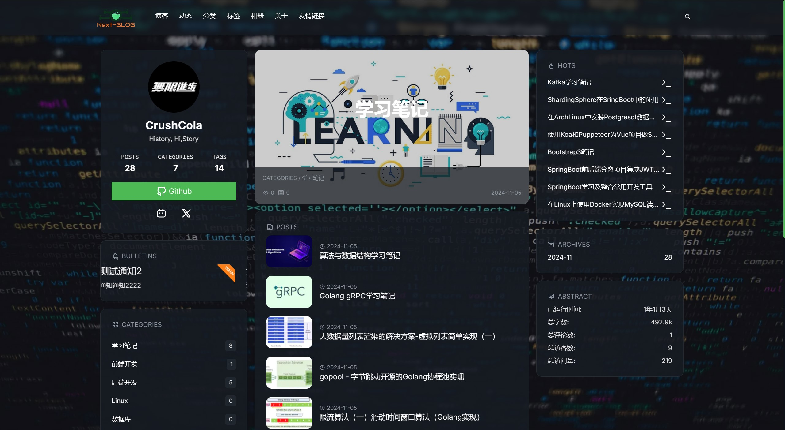

# next-fiber-blog
一个博客系统，基于多种技术栈实现

- 后端：`go-fiber` + `sonic` + `pgx` + `redis` + `elasticsearch` + `jwt`
- 管理后台：`Vue3` + `Pinia` + `Typescript` + `ArcoDesign`
- 前端：`Next.js` + `Typescript` + `UnoCSS`

[前端](./blog-front)    [管理后台](./blog-admin)   [后端 ](./go-fiber-server)   [博客地址](https://blog.zeroxn.com)

**暂停开发**

## 简介

一个功能完备的博客系统，个人学习全栈的练手网站。前端基于`Next.js`，具有完备的`SEO`优化；管理后台使用`Vue + Arco Design`，基于插拔式和模块化的思想，实现了大部分开源快速开发框架的功能（后序可能会将管理后台的框架部分分离，做一个单独的模板项目）；后端服务使用用`Restful`风格的接口进行数据交互，基于`middlewire`中间件实现了动态认证、限流、超时等插件，此外，还实现了`cache、pool、sql-build`三个包分别用于缓存、协程池和`SQL`语句构造。

## Preview

### 博客

博客首页

友情链接

分类

分类详情

文章详情

评论

### 管理后台

登录页

首页

站点配置

文章管理

服务监控

